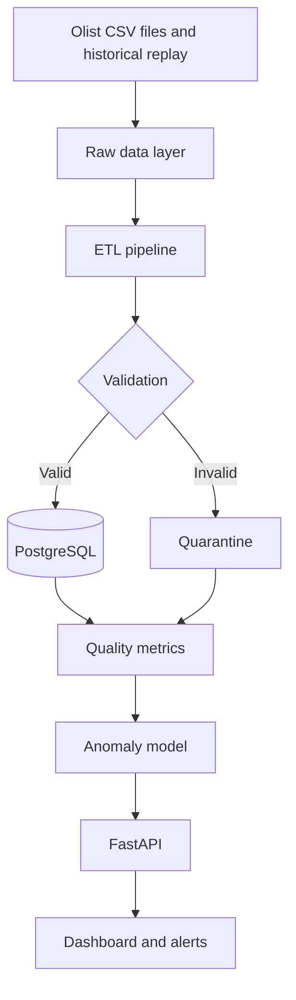

# CommerceGuard

### Intelligent data-quality monitoring for e-commerce pipelines

[](#project-status)
[](#technology-stack)
[](#machine-learning)

CommerceGuard is an end-to-end **data engineering, machine learning, and software engineering** project that monitors the quality of e-commerce data.

The planned pipeline will replay historical Olist orders as daily batches, validate related customer, product, seller, item, payment, and review data, and calculate quality metrics. Anomaly detection will help identify unusual pipeline behavior before unreliable data reaches reports or ML systems.

> This introductory machine learning portfolio project currently contains a README and nine Olist CSV files in `dataset/`. The pipeline, model, API, and dashboard are planned; they are not implemented yet.

---

## Table of contents

- [The problem](#the-problem)
- [Proposed solution](#proposed-solution)
- [Key features](#key-features)
- [Architecture](#architecture)
- [Machine learning](#machine-learning)
- [Dataset](#dataset)
- [Data validation](#data-validation)
- [Technology stack](#technology-stack)
- [Project structure](#project-structure)
- [Development roadmap](#development-roadmap)
- [Getting started](#getting-started)
- [Evaluation](#evaluation)
- [API design](#api-design)
- [Testing](#testing)
- [Future improvements](#future-improvements)
- [Learning objectives](#learning-objectives)
- [Privacy and safety](#privacy-and-safety)
- [License](#license)

---

## The problem

E-commerce companies depend on accurate data for revenue reporting, inventory management, payment processing, and customer analytics. A pipeline can complete successfully while still producing unreliable data.

Examples include:

- Duplicate orders that inflate revenue
- Missing customer or product identifiers
- Negative item prices or freight values
- Payments that do not match order totals
- Orders linked to nonexistent customers
- Sudden drops in daily order volume
- Unexpected increases in missing payment records
- Schema or date-format changes

Traditional validation rules find known errors, but they may miss new or unexpected behavior.

## Proposed solution

CommerceGuard combines two detection methods:

| Method | Question answered | Example |
| --- | --- | --- |
| Rule-based validation | Is this individual record valid? | An order item must reference an existing product. |
| ML anomaly detection | Is this entire daily batch behaving normally? | Today's order volume is unusually low. |

The planned pipeline will preserve invalid records in a quarantine area with their failure reasons, load valid records into PostgreSQL, and analyze daily quality metrics with an anomaly-detection model.

## Key features

Planned capabilities:

- Ingest the Olist CSV files and replay orders in daily batches
- Preserve an unchanged copy of every raw batch
- Clean and standardize values through an ETL pipeline
- Validate customers, products, sellers, orders, order items, payments, and reviews
- Quarantine rejected records instead of deleting them
- Track quality metrics for every pipeline execution
- Detect unusual batches with an Isolation Forest model
- Compare ML results with statistical and rule-based baselines
- Expose results through a FastAPI backend
- Visualize pipeline health in a Streamlit dashboard
- Test pipeline, validation, feature, and API behavior

## Architecture


```mermaid
flowchart TD
    A[Olist CSV files and historical replay] --> B[Raw data layer]
    B --> C[ETL pipeline]
    C --> D{Validation}
    D -->|Valid| E[(PostgreSQL)]
    D -->|Invalid| F[Quarantine]
    E --> G[Quality metrics]
    F --> G
    G --> H[Anomaly model]
    H --> I[FastAPI]
    I --> J[Dashboard and alerts]
```

### Processing flow

1. Group orders by `order_purchase_timestamp` date and select related records by their keys to simulate a daily batch. Reference tables are loaded separately.
2. The original files are stored in the raw layer.
3. The ETL pipeline cleans and standardizes each entity.
4. Validation rules separate valid and invalid records.
5. Valid data, rejected records, and run metadata are stored.
6. Daily metrics are calculated and passed to the ML model.
7. Predictions and possible causes appear in the dashboard.

## Machine learning

### Problem definition

The first ML task is **unsupervised anomaly detection**. The planned model will learn patterns from chronological historical batches and assign an anomaly score to each new batch. Olist has no pipeline-incident labels, and its historical records must not be assumed to be error-free.

### Input features

| Feature | Meaning |
| --- | --- |
| `row_count` | Orders in the purchase-date batch |
| `unique_customer_count` | Distinct `customer_unique_id` values after joining customers |
| `missing_value_ratio` | Missing required values divided by required values checked |
| `duplicate_ratio` | Duplicate records under each table's defined key policy |
| `rejected_record_ratio` | Rejected records divided by records validated |
| `average_order_value` | Mean per-order sum of `price + freight_value` for orders with items |
| `order_value_std` | Standard deviation of those per-order totals |
| `missing_payment_ratio` | Orders with no matching payment record divided by orders checked |
| `payment_mismatch_ratio` | Comparable orders whose aggregated payments differ from item totals beyond a documented tolerance |
| `pipeline_duration_seconds` | Processing time measured by the future pipeline, not supplied by Olist |

Refund and payment-failure rates cannot be calculated from these files: there are no refund or payment-status fields. Order status, delivery outcomes, and review scores describe the exported historical state. Use them only for retrospective analysis unless their availability at the scoring time can be established.

### Models

| Model | Purpose |
| --- | --- |
| Fixed thresholds | Rule-based baseline |
| Z-score or IQR | Statistical baseline |
| Isolation Forest | Primary anomaly-detection model |
| Local Outlier Factor | Optional comparison |

The project compares simple and ML-based methods instead of assuming the most complex model is automatically the best.

### Example output

```json
{
  "pipeline_run_id": 152,
  "status": "anomaly",
  "anomaly_score": 0.87,
  "possible_causes": [
    "Order volume is 51% below its historical average",
    "Missing customer identifiers increased to 14%"
  ]
}
```

## Dataset

The repository contains the **Brazilian E-Commerce Public Dataset by Olist**. Dataset source: [Olist on Kaggle](https://www.kaggle.com/datasets/olistbr/brazilian-ecommerce).

The counts and observations below were measured from the local CSV files with a CSV parser, excluding headers. Purchase timestamps range from **2016-09-04 21:15:19** to **2018-10-17 17:30:18**. These are historical exports, not live daily feeds.

### Files and schema

All paths are relative to `dataset/`. Column names below preserve the original spelling, including `lenght`.

| File | Rows | Columns |
| --- | ---: | --- |
| `olist_customers_dataset.csv` | 99,441 | `customer_id`, `customer_unique_id`, `customer_zip_code_prefix`, `customer_city`, `customer_state` |
| `olist_orders_dataset.csv` | 99,441 | `order_id`, `customer_id`, `order_status`, `order_purchase_timestamp`, `order_approved_at`, `order_delivered_carrier_date`, `order_delivered_customer_date`, `order_estimated_delivery_date` |
| `olist_order_items_dataset.csv` | 112,650 | `order_id`, `order_item_id`, `product_id`, `seller_id`, `shipping_limit_date`, `price`, `freight_value` |
| `olist_order_payments_dataset.csv` | 103,886 | `order_id`, `payment_sequential`, `payment_type`, `payment_installments`, `payment_value` |
| `olist_order_reviews_dataset.csv` | 99,224 | `review_id`, `order_id`, `review_score`, `review_comment_title`, `review_comment_message`, `review_creation_date`, `review_answer_timestamp` |
| `olist_products_dataset.csv` | 32,951 | `product_id`, `product_category_name`, `product_name_lenght`, `product_description_lenght`, `product_photos_qty`, `product_weight_g`, `product_length_cm`, `product_height_cm`, `product_width_cm` |
| `olist_sellers_dataset.csv` | 3,095 | `seller_id`, `seller_zip_code_prefix`, `seller_city`, `seller_state` |
| `olist_geolocation_dataset.csv` | 1,000,163 | `geolocation_zip_code_prefix`, `geolocation_lat`, `geolocation_lng`, `geolocation_city`, `geolocation_state` |
| `product_category_name_translation.csv` | 71 | `product_category_name`, `product_category_name_english` |

### Relationships and aggregation

- Join orders to customers on `customer_id`. The customer file has 99,441 distinct `customer_id` values and 96,096 distinct `customer_unique_id` values; use the latter for distinct shoppers across orders.
- Join items, payments, and reviews to orders on `order_id`. Each can have multiple rows per order. Item keys are `(order_id, order_item_id)`; payment keys are `(order_id, payment_sequential)`.
- Join items to products on `product_id` and sellers on `seller_id`. Join product categories to translations on `product_category_name`, preserving products without a matching translation.
- Match customer or seller ZIP prefixes to `geolocation_zip_code_prefix` only after defining an aggregation or lookup policy. There are 19,015 distinct prefixes across 1,000,163 geolocation rows, so a direct join can multiply rows. Read ZIP prefixes as strings to preserve leading zeros.
- Aggregate items and payments **separately per order before joining**. Derive an item-based total as `sum(price + freight_value)` and a payment total as `sum(payment_value)`. The order file has no stored `order_total`, and the item file has no `quantity` column.
- Do not assume `review_id` or `order_id` is unique in reviews: the file has 98,410 distinct review IDs and 98,673 distinct order IDs. Define a review-selection or aggregation policy before joining to order-level features.

### Observed data characteristics

- Order statuses: `delivered`, `shipped`, `canceled`, `unavailable`, `invoiced`, `processing`, `created`, and `approved`.
- Payment types: `credit_card`, `boleto`, `voucher`, `debit_card`, and `not_defined`. Nine payment rows have zero `payment_value`; investigate them instead of automatically treating them as failed payments.
- There are 160 missing approval timestamps, 1,783 missing carrier-delivery timestamps, and 2,965 missing customer-delivery timestamps. Missingness must be interpreted alongside order status.
- Product categories are missing in 610 rows; product weight and each dimension are missing in two rows.
- Review titles are empty in 87,656 rows and review messages in 58,247 rows. These optional fields should not be required by validation.
- Items cover 98,666 orders and payments cover 99,440 orders, compared with 99,441 orders in the orders file. Investigate coverage by status before rejecting records.
- The files do not provide customer names or emails, inventory counts, product names or descriptions themselves, currency codes, refund events, or payment success/failure flags.

### Controlled anomaly injection (planned)

Use copies of the original data to inject duplicate keys, missing identifiers, broken references, negative prices or freight, invalid dates or statuses, payment-total mismatches, and daily volume changes. Preserve the original CSV files unchanged. Record injected changes and affected batches separately for evaluation; never include injection labels in model inputs.

## Data validation

These are proposed rules, not results from an implemented validator.

| Entity | Rule | Severity |
| --- | --- | --- |
| Customer / product / seller | Entity ID is present and unique in its own table | Critical |
| Order | `order_id` is present and unique; referenced customer exists | Critical |
| Order | Status belongs to the observed accepted list | Warning |
| Order | Purchase and estimated delivery timestamps parse; other timestamps are checked when present with status-aware completeness rules | Critical / warning |
| Order item | `(order_id, order_item_id)` is unique; referenced order, product, and seller exist | Critical |
| Order item | `price` is positive and `freight_value` is nonnegative | Critical |
| Payment | `(order_id, payment_sequential)` is unique; referenced order exists | Critical |
| Payment | `payment_value` is nonnegative; zero values and `not_defined` types are flagged for review | Critical / warning |
| Payment | Per-order payment sum matches item price plus freight within a documented rounding tolerance, where both sides exist | Warning |
| Product | Missing categories or physical attributes are reported; present weights and dimensions are checked for plausibility | Warning |
| Review | Referenced order exists; `review_score` is an integer from 1 to 5; dates parse | Critical |
| Review | Repeated IDs are profiled under an explicit review policy; empty comments are allowed | Warning |
| Geolocation | Latitude is within -90 to 90 and longitude within -180 to 180; repeated ZIP prefixes are allowed | Critical |
| Category translation | Category key is unique; unmatched product categories are reported without dropping products | Warning |

Use decimal arithmetic or integer cents for financial reconciliation. Missing related rows, cancellations, and historical export limitations require investigation; a warning is not proof of corrupt data.

## Technology stack

Planned stack; dependencies and application code have not been added yet.

| Layer | Technology |
| --- | --- |
| Language | Python 3.12 |
| Data processing | Pandas |
| Machine learning | Scikit-learn |
| Database | PostgreSQL |
| ORM and migrations | SQLAlchemy and Alembic |
| Backend API | FastAPI |
| Dashboard | Streamlit |
| Validation | Pandera or custom validators |
| Testing | Pytest |
| Code quality | Ruff and Black |
| CI | GitHub Actions |
| Scheduling | Prefect after the MVP |

> Spark, Kafka, Airflow, and cloud infrastructure are intentionally excluded from the MVP. They may be explored only after the core pipeline and model work correctly.

## Project structure

Current contents (relative to this README):

```text
Data_Guard/
|-- README.md
`-- dataset/
    |-- olist_customers_dataset.csv
    |-- olist_geolocation_dataset.csv
    |-- olist_order_items_dataset.csv
    |-- olist_order_payments_dataset.csv
    |-- olist_order_reviews_dataset.csv
    |-- olist_orders_dataset.csv
    |-- olist_products_dataset.csv
    |-- olist_sellers_dataset.csv
    `-- product_category_name_translation.csv
```

Planned additions include `src/commerceguard/` for ingestion, replay, validation, pipelines, features, models, database, and API code; `notebooks/` for exploration; `data/` for derived and rejected records; `dashboard/`; and `tests/`.

## Development roadmap

### Project status

The project is currently in the **dataset exploration and planning stage**.

### MVP

- [ ] Define database entities and relationships
- [x] Add the nine Olist CSV files
- [ ] Build chronological daily replay from order purchase timestamps
- [ ] Implement reproducible anomaly injection on dataset copies
- [ ] Perform exploratory data analysis
- [ ] Create the PostgreSQL schema and migrations
- [ ] Implement the ETL pipeline
- [ ] Add critical validation rules
- [ ] Store rejected records and failure reasons
- [ ] Calculate daily quality metrics
- [ ] Build statistical baselines
- [ ] Train and evaluate an Isolation Forest
- [ ] Expose pipeline results through FastAPI
- [ ] Create the monitoring dashboard
- [ ] Add unit and integration tests

### After the MVP

- [ ] Schedule pipeline execution with Prefect
- [ ] Add email, Discord, or Slack alerts
- [ ] Add authentication and role-based access
- [ ] Containerize the application
- [ ] Add experiment tracking and model versioning
- [ ] Deploy the API, database, and dashboard

## Getting started

The repository currently supports dataset inspection. There is no installable package, database migration, API, dashboard, or test suite yet.

From the directory containing this README and `dataset/`, use Python 3.12 to inspect the files without installing dependencies:

```python
import csv
from pathlib import Path

for path in sorted(Path("dataset").glob("*.csv")):
    with path.open(encoding="utf-8-sig", newline="") as handle:
        reader = csv.reader(handle)
        columns = next(reader)
        row_count = sum(1 for _ in reader)
    print(f"{path.name}: {row_count:,} rows")
    print("  Columns:", ", ".join(columns))
```

Run this in a Python session or save it as a script. Use a CSV parser rather than counting physical lines because review comments can contain embedded newlines. Application setup and run commands will be added as the corresponding components are implemented.

## Evaluation

The original Olist files contain no ground-truth pipeline anomaly labels. Planned controlled injections will provide labels for measuring detection of known injected failures; those results do not establish accuracy on naturally occurring anomalies.

The planned evaluation will report:

- Precision
- Recall
- F1-score
- Confusion matrix
- False-positive rate
- Percentage of injected anomalies detected
- Batch-processing time

Use chronological training, validation, and test periods, fitting preprocessing and thresholds only on the appropriate earlier periods. Profile sparse boundary dates and seasonality before interpreting volume changes. Keep untouched reference batches alongside injected copies. Final order statuses, delivery dates, and reviews may occur after purchase; a purchase-date replay is retrospective unless those fields are withheld until their availability can be established.

## API design

Proposed endpoints; not implemented yet.

| Method | Endpoint | Purpose |
| --- | --- | --- |
| `GET` | `/health` | Check API availability |
| `GET` | `/pipeline-runs` | List recent runs |
| `GET` | `/pipeline-runs/{id}` | Inspect one run |
| `GET` | `/pipeline-runs/{id}/metrics` | Return quality metrics |
| `GET` | `/pipeline-runs/{id}/failures` | Return validation failures |
| `GET` | `/anomalies` | List detected anomalies |
| `POST` | `/predict` | Score new pipeline metrics |

## Testing

A Pytest suite is planned to cover:

- Reproducible historical replay and controlled anomaly injection
- CSV parsing, composite keys, and aggregation without join fan-out
- Transformation and validation logic
- Database operations
- Feature calculations
- Model input and output contracts
- API responses
- End-to-end pipeline execution

## Future improvements

- Add another e-commerce dataset or a demo API
- Detect schema changes and data drift
- Model weekends, holidays, promotions, and seasonality
- Explain anomalous metrics more precisely
- Support multiple stores and data sources
- Add alert acknowledgment and incident workflows
- Track experiments and model versions with MLflow
- Evaluate streaming tools when the project scale justifies them

## Learning objectives

CommerceGuard is designed to demonstrate:

- Exploratory data analysis and feature engineering
- ML baselines, model training, and evaluation
- Correct evaluation of an unsupervised model
- ETL pipeline and relational database design
- Data validation, observability, and incident investigation
- Backend API development
- Modular architecture and automated testing
- Reproducibility, monitoring, and technical documentation

## Privacy and safety

- Preserve the original public dataset and keep experimental modifications in separate files.
- Treat identifiers, location fields, and free-text reviews with care when publishing examples.
- Payment card details must never be collected or stored.
- An anomaly indicates unusual behavior, not proof of fraud or corruption.
- Predictions should support human investigation rather than silently delete data.
- Rejected records remain available for debugging and recovery.

## License

This project is intended for educational and portfolio purposes. No code `LICENSE` file is currently included. The Olist dataset is third-party data; consult its [source page](https://www.kaggle.com/datasets/olistbr/brazilian-ecommerce) for dataset licensing and attribution terms separately from any future code license.

---

If you have a suggestion or find a problem, please open an issue or submit a pull request.
